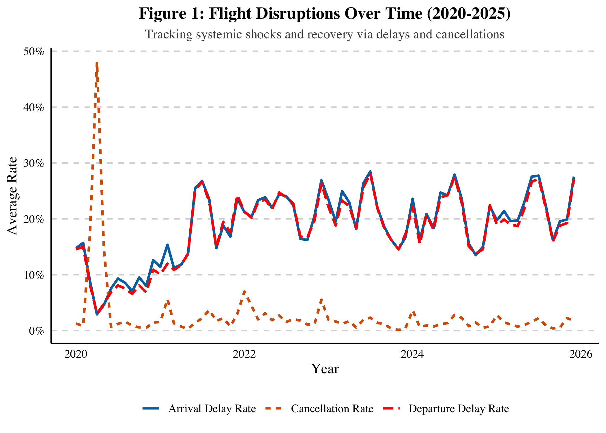
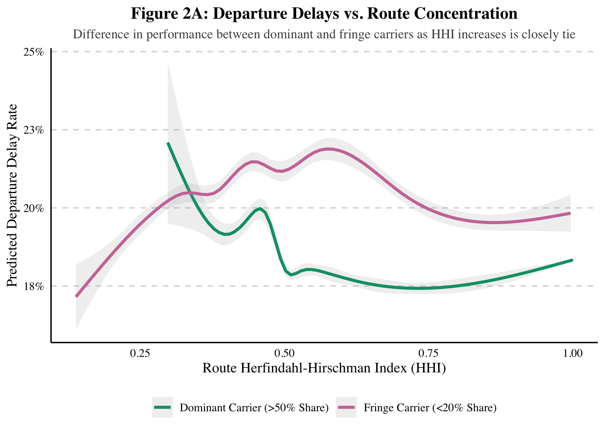
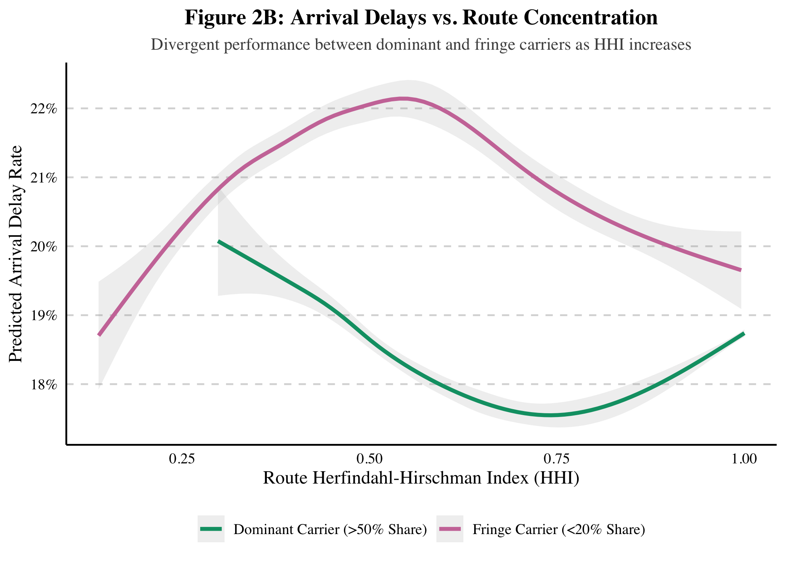
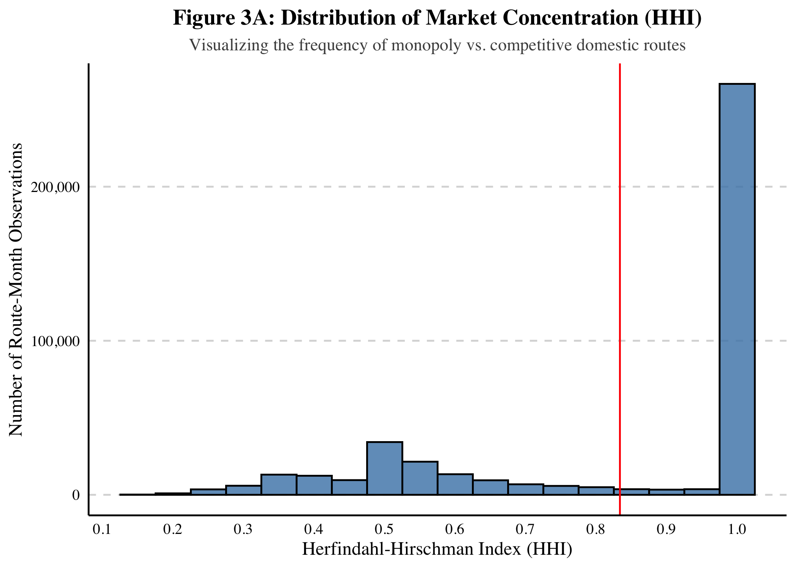
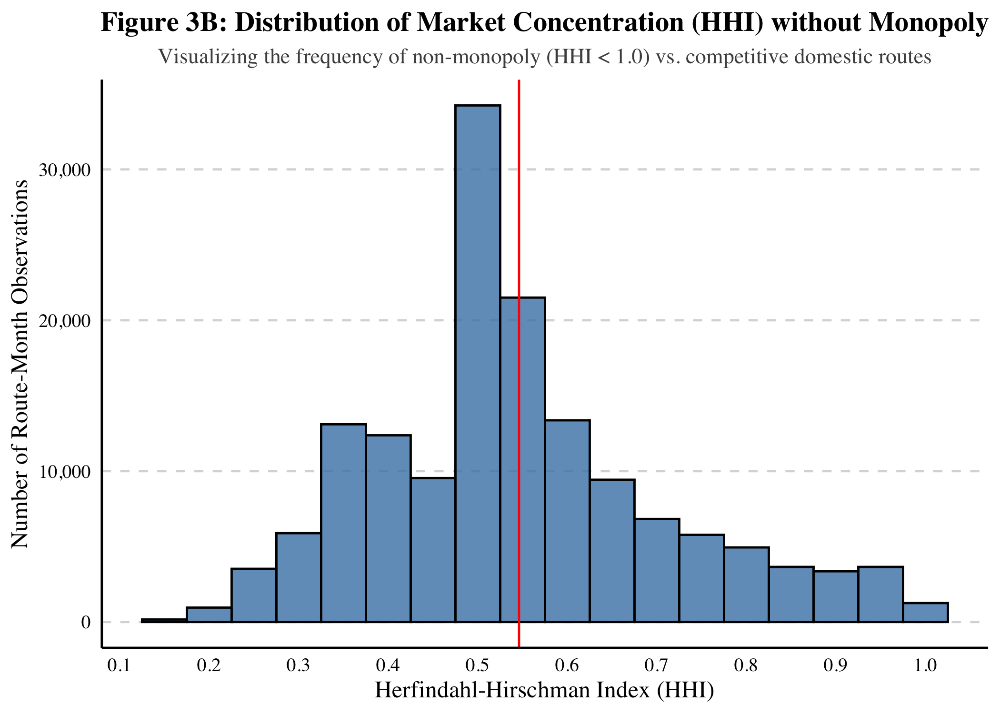
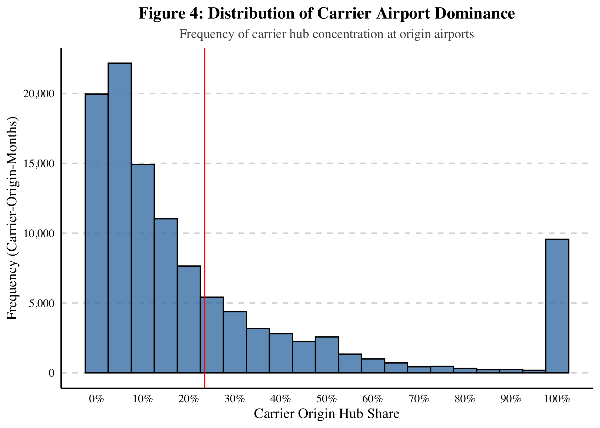
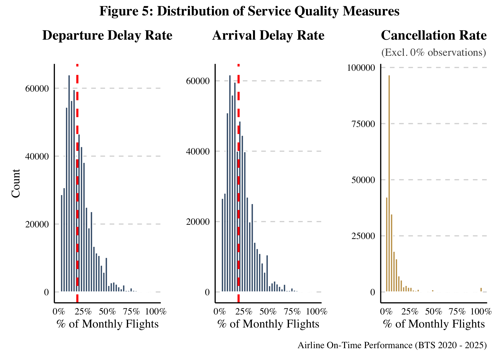
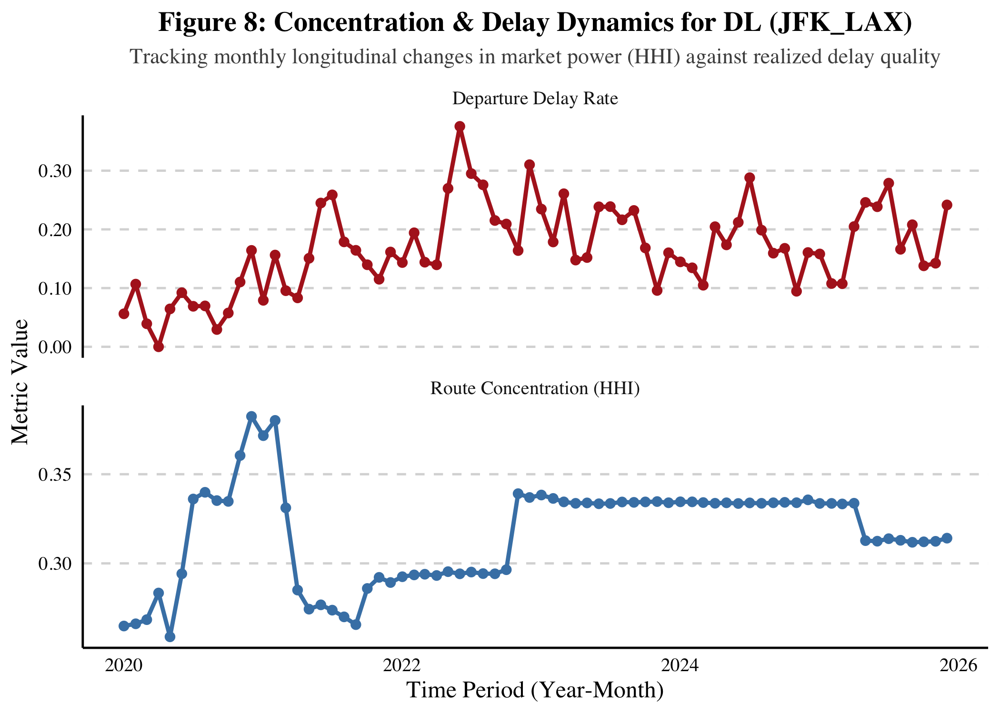
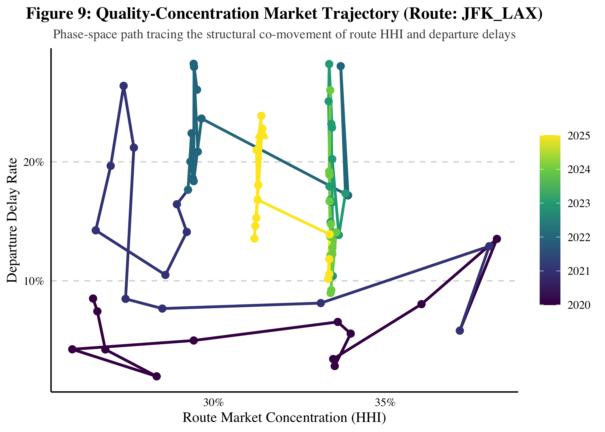

Exploratory Analysis – Summary Statistics and Visualizations
================
Eugene Kiepeeh

# Load Data

``` r
eda_data <- read_csv("../00_data/processed/model_data.csv")
```

# Feature Engineering

Add new variables for data analysis

``` r
eda_data <- eda_data |> 
  mutate(
    HHI_Tier = case_when(
      HHI < 0.15 ~ "Highly Competitive (< 0.15)",
      HHI >= 0.15 & HHI < 0.25 ~ "Moderately Concentrated (0.15 - 0.24)",
      HHI >= 0.25 & HHI < 1.0 ~ "Highly Concentrated (0.25 - 0.99)",
      HHI == 1.0 ~ "Pure Monopoly (= 1.0)",
      TRUE ~ NA_character_),
    Route_Density = case_when(
      route_total_flights < 60 ~ "Thin Route (< 60/mo)",
      route_total_flights >= 60 & route_total_flights <= 180 ~ "Moderate Route (60-180/mo)",
      route_total_flights > 180 ~ "Dense Route (> 180/mo)",
      TRUE ~ NA_character_),
    Route_Density = factor(Route_Density, 
                           levels = c("Thin Route (< 60/mo)", 
                                      "Moderate Route (60-180/mo)", 
                                      "Dense Route (> 180/mo)")),
    HHI_Tier = factor(HHI_Tier, levels = c(
                        "Highly Competitive (< 0.15)",
                        "Moderately Concentrated (0.15 - 0.24)",
                        "Highly Concentrated (0.25 - 0.99)",
                        "Pure Monopoly (= 1.0)")))
```

# Summary Statistics

``` r
print("Summary of Respone Variable")
```

    ## [1] "Summary of Respone Variable"

``` r
eda_data |> select(depDelay_rate, arrDelay_rate, cancel_rate) |> summary()
```

    ##  depDelay_rate     arrDelay_rate      cancel_rate     
    ##  Min.   :0.00000   Min.   :0.00000   Min.   :0.00000  
    ##  1st Qu.:0.08602   1st Qu.:0.09211   1st Qu.:0.00000  
    ##  Median :0.16129   Median :0.16667   Median :0.00000  
    ##  Mean   :0.18766   Mean   :0.19206   Mean   :0.02648  
    ##  3rd Qu.:0.25500   3rd Qu.:0.25862   3rd Qu.:0.02027  
    ##  Max.   :1.00000   Max.   :1.00000   Max.   :1.00000

``` r
print("Summary of Explanatory Variables")
```

    ## [1] "Summary of Explanatory Variables"

``` r
eda_data |> select(HHI, carrierHubShare, carrierRouteShare) |> summary()
```

    ##       HHI         carrierHubShare     carrierRouteShare  
    ##  Min.   :0.1378   Min.   :3.961e-05   Min.   :0.0007886  
    ##  1st Qu.:0.4736   1st Qu.:8.344e-02   1st Qu.:0.2839506  
    ##  Median :0.6570   Median :2.020e-01   Median :0.6521739  
    ##  Mean   :0.7039   Mean   :2.778e-01   Mean   :0.6274789  
    ##  3rd Qu.:1.0000   3rd Qu.:3.920e-01   3rd Qu.:1.0000000  
    ##  Max.   :1.0000   Max.   :1.000e+00   Max.   :1.0000000

``` r
print("Summary of More Variables")
```

    ## [1] "Summary of More Variables"

``` r
eda_data |> select(carrierTotalFlights, route_total_flights, n_carriers) |> summary()
```

    ##  carrierTotalFlights route_total_flights   n_carriers    
    ##  Min.   :  1.00      Min.   :   1.0      Min.   : 1.000  
    ##  1st Qu.: 24.00      1st Qu.:  38.0      1st Qu.: 1.000  
    ##  Median : 41.00      Median :  94.0      Median : 2.000  
    ##  Mean   : 61.26      Mean   : 145.4      Mean   : 2.175  
    ##  3rd Qu.: 86.00      3rd Qu.: 198.0      3rd Qu.: 3.000  
    ##  Max.   :818.00      Max.   :1319.0      Max.   :11.000

— Correlations

``` r
print("Correlations between response variable")
```

    ## [1] "Correlations between response variable"

``` r
eda_data |> select(depDelay_rate, arrDelay_rate, cancel_rate) |> cor()
```

    ##               depDelay_rate arrDelay_rate cancel_rate
    ## depDelay_rate    1.00000000    0.83299056 -0.08712974
    ## arrDelay_rate    0.83299056    1.00000000 -0.08876118
    ## cancel_rate     -0.08712974   -0.08876118  1.00000000

``` r
print("Correlations between explanatory variable")
```

    ## [1] "Correlations between explanatory variable"

``` r
eda_data |> select(HHI, carrierHubShare, carrierRouteShare) |> cor()
```

    ##                         HHI carrierHubShare carrierRouteShare
    ## HHI               1.0000000       0.3715317         0.8259836
    ## carrierHubShare   0.3715317       1.0000000         0.4289581
    ## carrierRouteShare 0.8259836       0.4289581         1.0000000

``` r
print("Correlations between more variable")
```

    ## [1] "Correlations between more variable"

``` r
eda_data |> select(carrierTotalFlights, route_total_flights, n_carriers) |> cor()
```

    ##                     carrierTotalFlights route_total_flights n_carriers
    ## carrierTotalFlights           1.0000000           0.5402729  0.1551914
    ## route_total_flights           0.5402729           1.0000000  0.7482184
    ## n_carriers                    0.1551914           0.7482184  1.0000000

> To know the number of `Highly concentrated thin route` meaning routes
> dominated by one or few airlines with small number of flights per
> month, we should distinct by `year_month_id`, `route_hhi`, and
> `route_density` that way each rows are distinct.

``` r
# Check the cross-tabulation: How many Monopolies are actually Dense?
dist_eda_data <- eda_data |>
  distinct(route_id, YEAR_MONTH_id, HHI, HHI_Tier, Route_Density)

print("Summary of Route Density")
```

    ## [1] "Summary of Route Density"

``` r
dist_eda_data |> select(Route_Density) |> summary()
```

    ##                     Route_Density   
    ##  Thin Route (< 60/mo)      :196078  
    ##  Moderate Route (60-180/mo):159188  
    ##  Dense Route (> 180/mo)    : 63787

``` r
print("Summary of Route Density by Route Competition")
```

    ## [1] "Summary of Route Density by Route Competition"

``` r
table(dist_eda_data$HHI_Tier, dist_eda_data$Route_Density) |> proportions(round(2))
```

    ##                                        
    ##                                         Thin Route (< 60/mo)
    ##   Highly Competitive (< 0.15)                   0.0000000000
    ##   Moderately Concentrated (0.15 - 0.24)         0.0000000000
    ##   Highly Concentrated (0.25 - 0.99)             0.0998480197
    ##   Pure Monopoly (= 1.0)                         0.9001519803
    ##                                        
    ##                                         Moderate Route (60-180/mo)
    ##   Highly Competitive (< 0.15)                         0.0000000000
    ##   Moderately Concentrated (0.15 - 0.24)               0.0014259869
    ##   Highly Concentrated (0.25 - 0.99)                   0.4824358620
    ##   Pure Monopoly (= 1.0)                               0.5161381511
    ##                                        
    ##                                         Dense Route (> 180/mo)
    ##   Highly Competitive (< 0.15)                     0.0004076066
    ##   Moderately Concentrated (0.15 - 0.24)           0.0299120510
    ##   Highly Concentrated (0.25 - 0.99)               0.8626992961
    ##   Pure Monopoly (= 1.0)                           0.1069810463

# Paper Tables

These are plots that made the final paper

``` r
vars_to_summarize <- c("depDelay_rate","arrDelay_rate", "cancel_rate", "HHI", "carrierRouteShare","carrierHubShare", "carrierTotalFlights", "route_total_flights")

# Compute the summary statistics
table1_data <- eda_data |>
  select(all_of(vars_to_summarize)) |>
  pivot_longer(everything(), names_to = "Variable", values_to = "Value") |>
  group_by(Variable) %>%
  summarise(
    N = sum(!is.na(Value)),
    Mean = mean(Value, na.rm = TRUE),
    `Std. Dev.` = sd(Value, na.rm = TRUE),
    Min = min(Value, na.rm = TRUE),
    `25th Pctl` = quantile(Value, 0.25, na.rm = TRUE),
    Median = median(Value, na.rm = TRUE),
    `75th Pctl` = quantile(Value, 0.75, na.rm = TRUE),
    Max = max(Value, na.rm = TRUE)) |>
  arrange(match(Variable, vars_to_summarize))

# format table
table1_formatted <- table1_data |>
  mutate(
    # Clean up variable names for the table
    Variable = case_when(
      Variable == "depDelay_rate" ~ "Departure Delay Rate",
      Variable == "arrDelay_rate" ~ "Arrival Delay Rate",
      Variable == "cancel_rate" ~ "Cancellation Rate",
      Variable == "HHI" ~ "HHI (Market Concentration)",
      Variable == "carrierRouteShare" ~ "Carrier Route Share",
      Variable == "hubShare_MONTH" ~ "Carrier Hub Share",
      Variable == "routeFlights_tot" ~ "Total Route Flights",
      Variable == "carrierTotalFlights" ~ "Carrier Total Incidents",
      TRUE ~ Variable),
    # Format N with commas
    N = format(N, big.mark = ","),
    # Round all other numeric columns to 3 decimal places
    across(where(is.numeric), ~ sprintf("%.3f", .))
    )

kable(table1_formatted |> select(-`25th Pctl`, -`75th Pctl`, -N), align = "lcccccccc", caption = "Table 1: Summary Statistics of the Full Sample", format = "latex")
```

``` r
write_csv(table1_formatted, "../04_output/tables/summary_stats.csv")
```

``` r
table2_data <- eda_data |>
  group_by(HHI_Tier) |>
  summarise(
    Unique_Routes = n_distinct(route_id),
    Mean_Delay_Rate = mean(depDelay_rate, na.rm = TRUE),
    Mean_Cancel_Rate = mean(cancel_rate, na.rm = TRUE),
    Mean_Route_Share = mean(carrierRouteShare, na.rm = TRUE)) |>
  filter(!is.na(HHI_Tier))

table2_formatted <- table2_data |>
  mutate(
    Unique_Routes = format(Unique_Routes, big.mark = ","),
    Mean_Delay_Rate = sprintf("%.2f%%", Mean_Delay_Rate * 100),
    Mean_Cancel_Rate = sprintf("%.2f%%", Mean_Cancel_Rate * 100),
    Mean_Route_Share = sprintf("%.2f%%", Mean_Route_Share * 100)) |>
  rename(
    `Market Concentration` = HHI_Tier,
    `Unique Routes` = Unique_Routes,
    `Mean Delay Rate` = Mean_Delay_Rate,
    `Mean Cancel Rate` = Mean_Cancel_Rate,
    `Mean Carrier Route Share` = Mean_Route_Share
  )

# Print the table neatly 
kable(table2_formatted, align = "lccccc", caption = "Table 2: Service Quality Performance by Market Concentration (HHI Tiers)")
```

| Market Concentration | Unique Routes | Mean Delay Rate | Mean Cancel Rate | Mean Carrier Route Share |
|:---|:--:|:--:|:--:|:--:|
| Highly Competitive (\< 0.15) | 4 | 20.46% | 1.47% | 10.24% |
| Moderately Concentrated (0.15 - 0.24) | 138 | 18.17% | 1.61% | 16.84% |
| Highly Concentrated (0.25 - 0.99) | 3,933 | 19.06% | 2.50% | 38.88% |
| Pure Monopoly (= 1.0) | 8,035 | 18.37% | 2.91% | 100.00% |

Table 2: Service Quality Performance by Market Concentration (HHI Tiers)

``` r
write_csv(table2_formatted, "../04_output/tables/hhi_tier_summarystats_general.csv")
```

``` r
hhi_tier_summarystats <- eda_data |>
  group_by(YEAR, HHI_Tier) |>
  summarise(
    Unique_Routes = n_distinct(route_id),
    Mean_Delay_Rate = mean(depDelay_rate, na.rm = TRUE),
    Mean_Cancel_Rate = mean(cancel_rate, na.rm = TRUE),
    Mean_Route_Share = mean(carrierRouteShare, na.rm = TRUE), .groups = "drop") |>
  filter(!is.na(HHI_Tier))


write_csv(hhi_tier_summarystats, "../04_output/tables/hhi_tier_summarystats.csv")
```

# Paper Plots

``` r
theme_pub <- function() {
  theme_minimal(base_size = 12, base_family = "serif") +
    theme(
      panel.grid.minor = element_blank(),
      panel.grid.major.x = element_blank(),
      panel.grid.major.y = element_line(color = "gray85", linetype = "dashed"),
      axis.line = element_line(color = "black"),
      axis.text = element_text(color = "black"),
      legend.position = "bottom",
      legend.title = element_blank(),
      plot.title = element_text(face = "bold", hjust = 0.5, size = 14),
      plot.subtitle = element_text(hjust = 0.5, size = 11, color = "gray30")
    )
}
```

``` r
# -------------------------------------------------------------------------
# Figure 1: The Macro View – Flight Disruptions Over Time (2020–2025)
# -------------------------------------------------------------------------
fig1_data <- eda_data |>
  # Create a proper Date object for the continuous x-axis
  mutate(Date = ymd(paste(YEAR, MONTH, "01", sep = "-"))) |>
  group_by(Date) |>
  summarise(
    Mean_Cancel = mean(cancel_rate, na.rm = TRUE),
    Mean_ArrDelay = mean(arrDelay_rate, na.rm = TRUE),
    Mean_DepDelay = mean(depDelay_rate, na.rm = TRUE),
    .groups = "drop") |>
  pivot_longer(
    cols = c(Mean_Cancel, Mean_ArrDelay, Mean_DepDelay), 
    names_to = "Metric", 
    values_to = "Rate") |>
  mutate(
    Metric = case_when(Metric == "Mean_Cancel" ~ "Cancellation Rate", Metric == "Mean_ArrDelay" ~ "Arrival Delay Rate", TRUE ~ "Departure Delay Rate"))

fig1 <- ggplot(fig1_data, 
               aes(x = Date, y = Rate, 
                              color = Metric, linetype = Metric)) +
  geom_line(linewidth = 1) +
  scale_y_continuous(labels = percent_format(accuracy = 1)) +
  scale_color_manual(values = c("Cancellation Rate" = "#D55E00", "Arrival Delay Rate" = "#0072B2", "Departure Delay Rate" = "red")) +
  labs(
    title = "Figure 1: Flight Disruptions Over Time (2020-2025)",
    subtitle = "Tracking systemic shocks and recovery via delays and cancellations",
    x = "Year",
    y = "Average Rate"
  ) +
  theme_pub()

print(fig1)
```

<!-- -->

``` r
# -------------------------------------------------------------------------
# Figure 2: The Core Question – Delays vs. Market Concentration
# -------------------------------------------------------------------------
fig2_data <- eda_data |>
  mutate(
    Dominance_Tier = case_when(
      carrierRouteShare > 0.50 ~ "Dominant Carrier (>50% Share)",
      carrierRouteShare < 0.20 ~ "Fringe Carrier (<20% Share)",
      TRUE ~ NA_character_ # We exclude the middle to make the contrast visually stark
    )) |>
  filter(!is.na(Dominance_Tier))

fig2_a <- ggplot(fig2_data, aes(x = HHI, y = depDelay_rate, color = Dominance_Tier)) +
  # Using LOESS smoothing to show the non-linear divergence
  geom_smooth(se = TRUE, size = 1.2, alpha = 0.15) +
  scale_y_continuous(labels = percent_format(accuracy = 1)) +
  scale_color_manual(values = c("Dominant Carrier (>50% Share)" = "#009E73", 
                                "Fringe Carrier (<20% Share)" = "#CC79A7")) +
  labs(
    title = "Figure 2A: Departure Delays vs. Route Concentration",
    subtitle = "Difference in performance between dominant and fringe carriers as HHI increases is closely tie",
    x = "Route Herfindahl-Hirschman Index (HHI)",
    y = "Predicted Departure Delay Rate"
  ) +
  theme_pub()

fig2_b <- ggplot(fig2_data, aes(x = HHI, y = arrDelay_rate, color = Dominance_Tier)) +
  # Using LOESS smoothing to show the non-linear divergence
  geom_smooth(se = TRUE, size = 1.2, alpha = 0.15) +
  scale_y_continuous(labels = percent_format(accuracy = 1)) +
  scale_color_manual(values = c("Dominant Carrier (>50% Share)" = "#009E73", 
                                "Fringe Carrier (<20% Share)" = "#CC79A7")) +
  labs(
    title = "Figure 2B: Arrival Delays vs. Route Concentration",
    subtitle = "Divergent performance between dominant and fringe carriers as HHI increases",
    x = "Route Herfindahl-Hirschman Index (HHI)",
    y = "Predicted Arrival Delay Rate"
  ) +
  theme_pub()

print(fig2_a)
```

<!-- -->

``` r
print(fig2_b)
```

<!-- -->

``` r
# -------------------------------------------------------------------------
# Figure 3A: Distribution of Route HHI
# -------------------------------------------------------------------------
# We want unique route-month observations so we don't overcount highly-trafficked routes
fig3_data <- eda_data |>
  distinct(YEAR_MONTH_id, route_id, HHI) 

fig3_a <- ggplot(fig3_data, aes(x = HHI)) +
  geom_histogram(
    binwidth = 0.05, 
    fill = "#4682B4", 
    color = "black", 
    alpha = 0.8
  ) +
  geom_vline(aes(xintercept = mean(HHI, na.rm = T)), color = "red") +
  scale_x_continuous(breaks = seq(0, 1, by = 0.1)) +
  scale_y_continuous(labels = comma_format()) +
  labs(
    title = "Figure 3A: Distribution of Market Concentration (HHI)",
    subtitle = "Visualizing the frequency of monopoly vs. competitive domestic routes",
    x = "Herfindahl-Hirschman Index (HHI)",
    y = "Number of Route-Month Observations"
  ) +
  theme_pub()

print(fig3_a)
```

<!-- -->

``` r
# -------------------------------------------------------------------------
# Figure 3B: Distribution of Route HHI without Monopoly
# -------------------------------------------------------------------------
# This is to show the distribution without distortion by the monopolized routes

fig3b_data <- eda_data |>
  distinct(YEAR_MONTH_id, route_id, HHI) |>
  filter(HHI != 1)

fig3_b <- ggplot(fig3b_data, aes(x = HHI)) +
  geom_histogram(
    binwidth = 0.05, 
    fill = "#4682B4", 
    color = "black", 
    alpha = 0.8) +
  geom_vline(aes(xintercept = mean(HHI, na.rm = T)), color = "red") +
  scale_x_continuous(breaks = seq(0, 1, by = 0.1)) +
  scale_y_continuous(labels = comma_format()) +
  labs(
    title = "Figure 3B: Distribution of Market Concentration (HHI) without Monopoly",
    subtitle = "Visualizing the frequency of non-monopoly (HHI < 1.0) vs. competitive domestic routes",
    x = "Herfindahl-Hirschman Index (HHI)",
    y = "Number of Route-Month Observations"
  ) +
  theme_pub()

print(fig3_b)
```

<!-- -->

``` r
# -------------------------------------------------------------------------
# Figure 4: Distribution of Carrier Hub Share at Origin Airports
# -------------------------------------------------------------------------
# Extract unique carrier-origin-month observations to prevent double counting
fig4_data <- eda_data |>
  distinct(YEAR_MONTH_id, ORIGIN, Carrier, carrierHubShare) |>
  filter(!is.na(carrierHubShare))

# Calculate empirical mean for annotation
mean_hub_share <- mean(fig4_data$carrierHubShare, na.rm = TRUE)

fig4 <- ggplot(fig4_data, aes(x = carrierHubShare)) +
  geom_histogram(
    binwidth = 0.05, fill = "#4682B4", 
    color = "black", alpha = 0.8) +
  geom_vline(xintercept = mean_hub_share, color = "red") +
  scale_x_continuous(
    breaks = seq(0, 1, by = 0.1),
    labels = scales::percent_format(accuracy = 1)) +
  scale_y_continuous(labels = scales::comma_format()) +
  labs(
    title = "Figure 4: Distribution of Carrier Airport Dominance",
    subtitle = "Frequency of carrier hub concentration at origin airports",
    x = "Carrier Origin Hub Share",
    y = "Frequency (Carrier-Origin-Months)") +
  theme_pub()

print(fig4)
```

<!-- -->

``` r
delay_color <- "#002C54" 
cancel_color <- "#C5A059" 

# 1. Departure Delay Distribution
plt1 <- eda_data |>
  ggplot(aes(x = depDelay_rate)) + 
  geom_histogram(fill = delay_color, color = "white", bins = 40, alpha = 0.8) +
  geom_vline(aes(xintercept = mean(depDelay_rate, na.rm = TRUE)), color = "red", linetype = "dashed", size = 1) +
  scale_x_continuous(labels = percent_format(), limits = c(0, 1)) +
  labs(title = "Departure Delay Rate", x = "% of Monthly Flights", y = "Count") +
  theme_pub()

# 2. Arrival Delay Distribution
plt2 <- eda_data |>
  ggplot(aes(x = arrDelay_rate)) + 
  geom_histogram(fill = delay_color, color = "white", bins = 40, alpha = 0.8) +
  geom_vline(aes(xintercept = mean(arrDelay_rate, na.rm = TRUE)), color = "red", linetype = "dashed", size = 1) +
  scale_x_continuous(labels = percent_format(), limits = c(0, 1)) +
  labs(title = "Arrival Delay Rate", x = "% of Monthly Flights", y = "") +
  theme_pub()

# 3. Cancellation Distribution 
plt3 <- eda_data |>
  filter(cancel_rate > 0) |>
  ggplot(aes(x = cancel_rate)) + 
  geom_histogram(fill = cancel_color, color = "white", bins = 40) +
  scale_x_continuous(labels = percent_format()) +
  labs(title = "Cancellation Rate", subtitle = "(Excl. 0% observations)", x = "% of Monthly Flights", y = "") +
  theme_pub()


final_plot <- (plt1 | plt2 | plt3) + 
  plot_annotation(
    title = "Figure 5: Distribution of Service Quality Measures",
    caption = "Airline On-Time Performance (BTS 2020 - 2025)",
    theme = theme_pub())

print(final_plot)
```

<!-- -->

# save plots

``` r
# Save Figures
ggsave("../04_output/figures/fig1_macro_view.pdf", plot = fig1, width = 8, height = 5, units = "in")

ggsave("../04_output/figures/fig2_core_mechanism.pdf", plot = fig2_a, width = 8, height = 5, units = "in")
ggsave("../04_output/figures/fig2_core_mechanism2.pdf", plot = fig2_b, width = 8, height = 5, units = "in")

ggsave("../04_output/figures/fig3a_hhi_dist_monopoly.pdf", plot = fig3_a, width = 8, height = 5, units = "in")
ggsave("../04_output/figures/fig3b_hhi_dist_comp.pdf", plot = fig3_b, width = 8, height = 5, units = "in")

ggsave("../04_output/figures/fig4_hubshare_dist.pdf", plot = fig4, width = 8, height = 5, units = "in")

ggsave("../04_output/figures/fig6_delay_cancel_dist.pdf", plot = final_plot, width = 8, height = 5, units = "in")
```

# More Advanced EDA

``` r
# -------------------------------------------------------------------------
# Track HHI and Delays Over Time for a Carrier-Route
# -------------------------------------------------------------------------

target_carrier <- "DL"
target_route   <- "JFK_LAX" 

track_data <- eda_data |>
  mutate(Date = ymd(paste(YEAR, MONTH, "01", sep = "-"))) |>
  filter(Carrier == target_carrier, route_id == target_route) |>
  group_by(Date) |>
  summarize(
    `Route Concentration (HHI)` = mean(HHI, na.rm = TRUE),
    `Departure Delay Rate`       = mean(depDelay_rate, na.rm = TRUE),
    .groups = "drop"
  ) |>
  pivot_longer(
    cols      = c(`Route Concentration (HHI)`, `Departure Delay Rate`),
    names_to  = "Metric",
    values_to = "Value"
  )

fig_track <- ggplot(track_data, aes(x = Date, y = Value, color = Metric, group = Metric)) +
  geom_line(linewidth = 1) +
  geom_point(size = 1.8) +
  facet_wrap(~ Metric, scales = "free_y", ncol = 1) +
  scale_color_manual(values = c("Route Concentration (HHI)" = "#4682B4", "Departure Delay Rate" = "#B22222")) +
  scale_y_continuous(labels = label_number(accuracy = 0.01)) +
  labs(
    title    = paste0("Figure 8: Concentration & Delay Dynamics for ", target_carrier, " (", target_route, ")"),
    subtitle = "Tracking monthly longitudinal changes in market power (HHI) against realized delay quality",
    x        = "Time Period (Year-Month)",
    y        = "Metric Value"
  ) +
  theme_pub() +
  theme(legend.position = "none")

print(fig_track)
```

<!-- -->

``` r
# -------------------------------------------------------------------------
# Market Evolution Trajectory 
# -------------------------------------------------------------------------
target_route <- "JFK_LAX"

trajectory_data <- eda_data |>
  mutate(Date = ymd(paste(YEAR, MONTH, "01", sep = "-"))) |>
  filter(route_id == target_route) |>
  group_by(YEAR, Date) |>
  summarize(
    mean_hhi        = mean(HHI, na.rm = TRUE),
    mean_delay_rate = mean(depDelay_rate, na.rm = TRUE),
    .groups         = "drop") |>
  arrange(Date)

fig_trajectory <- ggplot(trajectory_data, aes(x = mean_hhi, y = mean_delay_rate)) +
  geom_path(
    aes(color = YEAR, group = 1), 
    linewidth = 1.1, 
    arrow = arrow(type = "closed", length = unit(0.12, "inches"))
  ) +
  geom_point(aes(color = YEAR), size = 2.5) +
  scale_color_viridis_c(option = "viridis", name = "Year") +
  scale_x_continuous(labels = percent_format(accuracy = 1)) +
  scale_y_continuous(labels = percent_format(accuracy = 1)) +
  labs(
    title    = paste0("Figure 9: Quality-Concentration Market Trajectory (Route: ", target_route, ")"),
    subtitle = "Phase-space path tracing the structural co-movement of route HHI and departure delays",
    x        = "Route Market Concentration (HHI)",
    y        = "Departure Delay Rate"
  ) +
  theme_pub() +
  theme(
    legend.position   = "right",
    legend.key.height = unit(1, "cm")
  )

print(fig_trajectory)
```

<!-- -->
